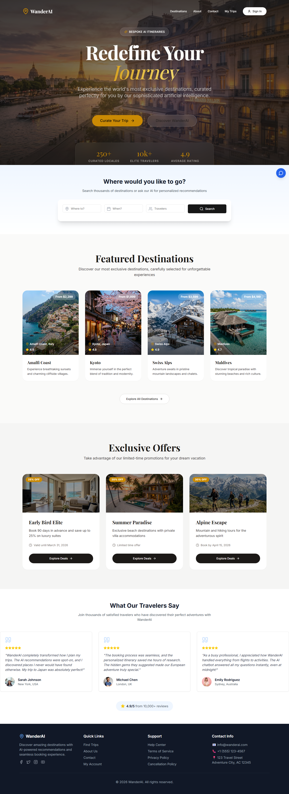

# WanderAI - Luxury Travel Platform

WanderAI is a premium, AI-powered travel platform designed to provide exclusive, personalized travel experiences. 

## Deployment
**Live Demo:** [https://tourism-ten-gamma.vercel.app](https://tourism-ten-gamma.vercel.app)

## Project Description
This repository contains the completely overhauled frontend for WanderAI, redesigned using the highly-premium "Liquid Glass" design system. The user interface aims for a luxurious, modern, and sophisticated aesthetic suited for elite travelers.

### Key Features
- **Liquid Glass Design System**: Deep backgrounds with blur effects, elegant typography combining \Playfair Display\ (serif) and \Inter\ (sans-serif), and refined golden accents (#CA8A04).
- **Responsive Navigation**: A dynamic, glassmorphic navigation bar that seamlessly reacts to user scroll.
- **AI-Powered Recommendations**: Curated destinations and exclusive seasonal offers presented beautifully.
- **Premium Imagery**: High-quality, cinematic travel photography for all destinations and hero sections.
- **Performance Optimized**: Built with Next.js 13+, featuring optimized server-side rendering and statically generated core pages.

### Technology Stack
- **Framework**: Next.js 13+ (App Router)
- **Styling**: Tailwind CSS
- **Icons**: Lucide React
- **UI Components**: Radix UI / custom components
